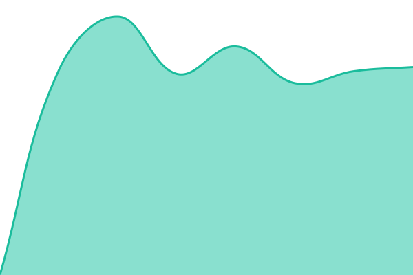
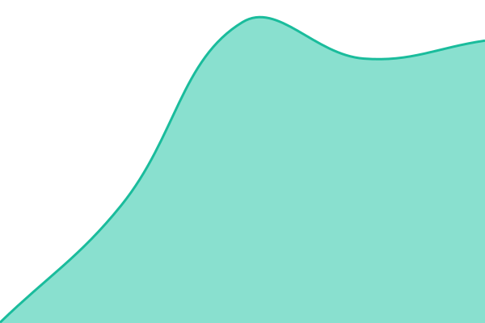
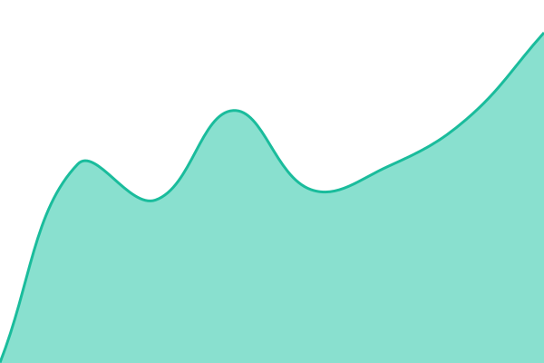
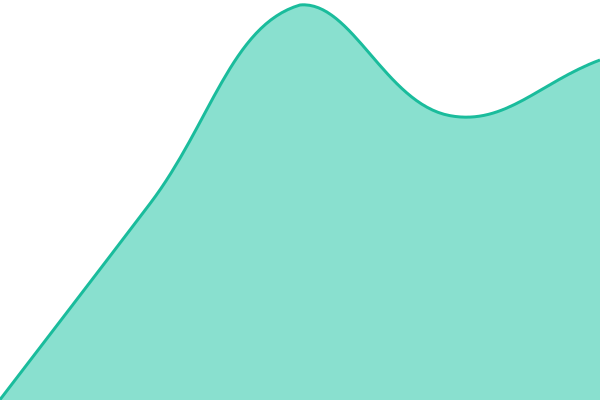

# [📈 Live Status](https://YCE-Andy.github.io/status): <!--live status--> **🟩 All systems operational**

This repository contains the open-source uptime monitor and status page for [YCE-Andy](https://YCE-Andy.github.io/status), powered by [Upptime](https://github.com/upptime/upptime).

With [Upptime](https://upptime.js.org), you can get your own unlimited and free uptime monitor and status page, powered entirely by a GitHub repository. We use [Issues](https://github.com/YCE-Andy/status/issues) as incident reports, [Actions](https://github.com/YCE-Andy/status/actions) as uptime monitors, and [Pages](https://YCE-Andy.github.io/status) for the status page.

<!--start: status pages-->
<!-- This summary is generated by Upptime (https://github.com/upptime/upptime) -->
<!-- Do not edit this manually, your changes will be overwritten -->
<!-- prettier-ignore -->
| URL | Status | History | Response Time | Uptime |
| --- | ------ | ------- | ------------- | ------ |
|  [StratoSig](https://stratosig.com/) | 🟩 Up | [strato-sig.yml](https://github.com/YCE-Andy/status/commits/HEAD/history/strato-sig.yml) | 

 682ms
     
 | 

<a href="https://YCE-Andy.github.io/status/history/strato-sig">100.00%</a>
    

|  [StratoSig Scoreboard API](https://stratosig.com/api/scoreboard) | 🟩 Up | [strato-sig-scoreboard-api.yml](https://github.com/YCE-Andy/status/commits/HEAD/history/strato-sig-scoreboard-api.yml) | 

 450ms
     
 | 

<a href="https://YCE-Andy.github.io/status/history/strato-sig-scoreboard-api">100.00%</a>
    

|  [Counsel AI](https://counsel-ai.org/) | 🟩 Up | [counsel-ai.yml](https://github.com/YCE-Andy/status/commits/HEAD/history/counsel-ai.yml) | 

 508ms
     
 | 

<a href="https://YCE-Andy.github.io/status/history/counsel-ai">100.00%</a>
    

|  [Jarvis](https://jarvis.olijammedia.co.uk/) | 🟩 Up | [jarvis.yml](https://github.com/YCE-Andy/status/commits/HEAD/history/jarvis.yml) | 

 705ms
     
 | 

<a href="https://YCE-Andy.github.io/status/history/jarvis">100.00%</a>
    

<!--end: status pages-->

[**Visit our status website →**](https://YCE-Andy.github.io/status)

## 📄 License

- Powered by: [Upptime](https://github.com/upptime/upptime)
- Code: [MIT](./LICENSE) © [Anand Chowdhary](https://anandchowdhary.com)
- Data in the `./history` directory: [Open Database License](https://opendatacommons.org/licenses/odbl/1-0/)
